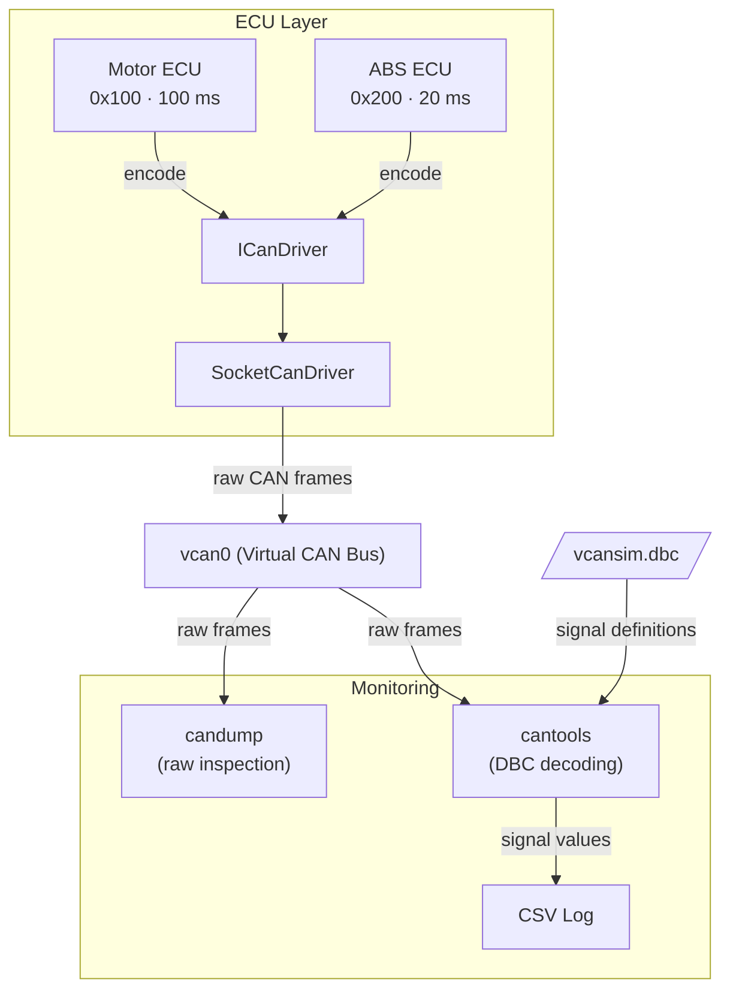

# VcanSim

> Virtual CAN Network Simulator for Embedded Linux


VcanSim simulates a multi-ECU CAN network entirely in software, no hardware required.
Built on Linux SocketCAN (`vcan`), it runs the real kernel CAN stack without any physical CAN interface.

## Overview

VcanSim consists of two simulated ECU nodes that produce realistic CAN traffic over a virtual bus,
and a Python-based monitor that decodes and logs signals in real time using a DBC file.

ECU logic is decoupled from the platform-specific CAN driver via an `ICanDriver` interface,
improving portability and testability.

At runtime, the Motor and ABS ECUs are launched by separate runner executables, so they operate as independent processes.

## Features

- Two C++ ECU simulators producing realistic CAN traffic over a virtual bus
- DBC-based signal definition (compatible with CANalyzer and cantools) and manual encoding in C++
- Live signal monitoring and CSV logging via `python-can` and `cantools`
- Optional raw frame inspection using `candump`
- GoogleTest unit tests and Python integration tests
## Architecture



**ECU (Electronic Control Unit):** a simulated vehicle node that sends cyclic CAN messages. VcanSim includes a Motor ECU (RPM, temperature) and an ABS ECU (wheel speeds). Each runs as an independent Linux process.

**ICanDriver:** a C++ abstract interface that decouples ECU logic from any specific CAN driver. ECUs call `send()` and `receive()` without knowing the underlying implementation.

**SocketCanDriver:** the concrete implementation of `ICanDriver` for Linux. It uses the POSIX socket API to write raw CAN frames to the kernel.

**vcan0:** a virtual CAN bus provided by the Linux kernel SocketCAN module. It behaves identically to a physical CAN bus but requires no hardware.

**candump:** a standard Linux tool from `can-utils` that reads raw CAN frames directly from the bus.

**cantools:** a Python library that parses DBC files and decodes raw CAN frame bytes into readable signal values such as RPM or temperature.

**DBC file:** an industry-standard file format that defines CAN message IDs, signal names, scaling, offset, and units. Used by tools like CANalyzer and cantools.

**CSV Log:** the output of the monitor script, one row per decoded frame with timestamp and signal values.

## Project Structure

```
vcan-sim/
│
├── src/
│   ├── common/                         # Platform-independent core
│   │   ├── can_frame.h                 # CanFrame struct
│   │   ├── ican_driver.h               # Abstract CAN driver interface
│   │   ├── itimer.h                    # Abstract timer interface
│   │   ├── isensor.h                   # Abstract sensor interface and type aliases
│   │   ├── signal_encoder.h / .cpp     # Bit encoding / decoding
│   │   └── base_ecu.h / .cpp           # Abstract base class for all ECUs
│   │
│   ├── platform/
│   │   └── linux/                      # Linux-specific implementations
│   │       ├── timer.h / .cpp          # Linux timer (std::this_thread::sleep_for)
│   │       └── socketcan/              # Linux SocketCAN driver
│   │           ├── driver.h
│   │           └── driver.cpp
│   │
│   ├── ecu/                            # ECU simulators
│   │   ├── motor_ecu.h / .cpp
│   │   └── abs_ecu.h / .cpp
│   │
│   ├── sim/                            # Simulation sensor implementations
│   │   ├── rpm_sensor.h
│   │   ├── temp_sensor.h
│   │   └── wheel_sensor.h
│   │
│   └── monitor/
│       └── can_monitor.py              # Live decoder + CSV logger
│
├── tests/
│   ├── mocks/                          # Test doubles (no hardware dependency)
│   │   ├── mock_can_driver.h
│   │   ├── mock_timer.h
│   │   └── mock_sensor.h
│   ├── unit/                           # GoogleTest
│   │   ├── test_signal_encoding.cpp    
│   │   ├── test_motor_ecu.cpp          
│   │   └── test_abs_ecu.cpp            
│   └── integration/
│       └── test_frames.py              # Python integration tests
│
├── dbc/
│   └── vcansim.dbc                     # Signal definitions
│
├── docs/
│   ├── requirements.md
│   ├── architecture.md
│   └── signal-encoding.md
│
├── scripts/
│   └── setup_vcan.sh                   # One-shot vcan0 setup
│
└── CMakeLists.txt
```

## Getting Started

### Requirements

- Linux with GCC and CMake
- `libgtest-dev`

### Install Dependencies

```bash
sudo apt install -y cmake g++ libgtest-dev
```

### Build

```bash
mkdir build && cd build
cmake ..
```

### Run Unit Tests

```bash
make unit_tests
ctest --verbose
```

## License

MIT