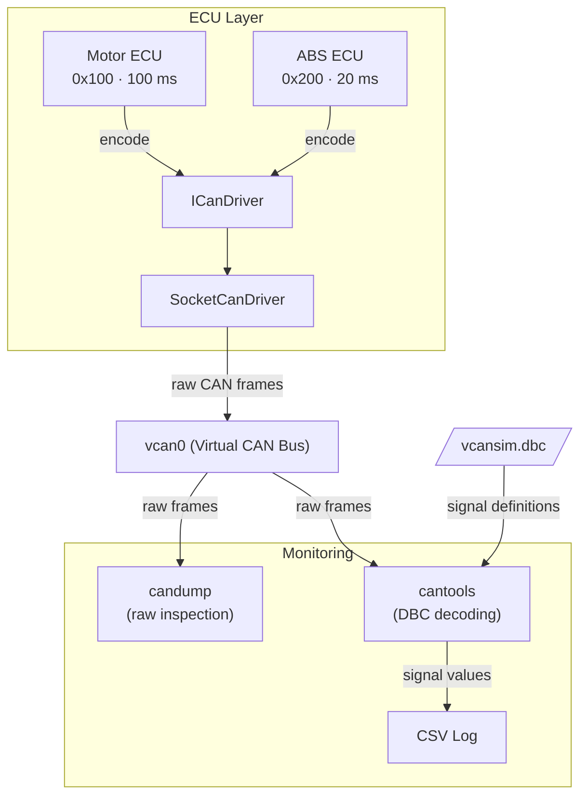

# VcanSim

> Virtual CAN Network Simulator for Embedded Linux

VcanSim simulates a multi-ECU CAN network entirely in software, no hardware required.
Built on Linux SocketCAN (`vcan`), it runs the real kernel CAN stack without any physical CAN interface.

## Overview

VcanSim consists of two simulated ECU nodes that produce realistic CAN traffic over a virtual bus,
and a Python-based monitor that decodes and logs signals in real time using a DBC file.

ECU logic is decoupled from the platform-specific CAN driver via an `ICanDriver` interface,
improving portability, testability, and future migration to embedded hardware.

## Features

- Two C++ ECU simulators inheriting from a shared `BaseEcu` abstract class

- DBC-based signal definition and manual encoding in C++
- Live signal monitoring and CSV logging via `python-can` and `cantools`
- Optional raw frame inspection using `candump`
- GoogleTest unit tests and Python integration tests
- Driver abstraction via `ICanDriver` interface

## Architecture

**ECU (Electronic Control Unit):** a simulated vehicle node that sends cyclic CAN messages. VcanSim includes a Motor ECU (RPM, temperature) and an ABS ECU (wheel speeds). Each runs as an independent Linux process.

**ICanDriver:** a C++ abstract interface that decouples ECU logic from any specific CAN driver. ECUs call `send()` and `receive()` without knowing the underlying implementation.

**SocketCanDriver:** the concrete implementation of `ICanDriver` for Linux. It uses the POSIX socket API to write raw CAN frames to the kernel.

**vcan0:** a virtual CAN bus provided by the Linux kernel SocketCAN module. It behaves identically to a physical CAN bus but requires no hardware.

**candump:** a standard Linux tool from `can-utils` that reads raw CAN frames directly from the bus.

**cantools:** a Python library that parses DBC files and decodes raw CAN frame bytes into readable signal values such as RPM or temperature.

**DBC file:** an industry-standard file format that defines CAN message IDs, signal names, scaling, offset, and units. Used by tools like CANalyzer and cantools.

**CSV Log:** the output of the monitor script, one row per decoded frame with timestamp and signal values.

## License

MIT