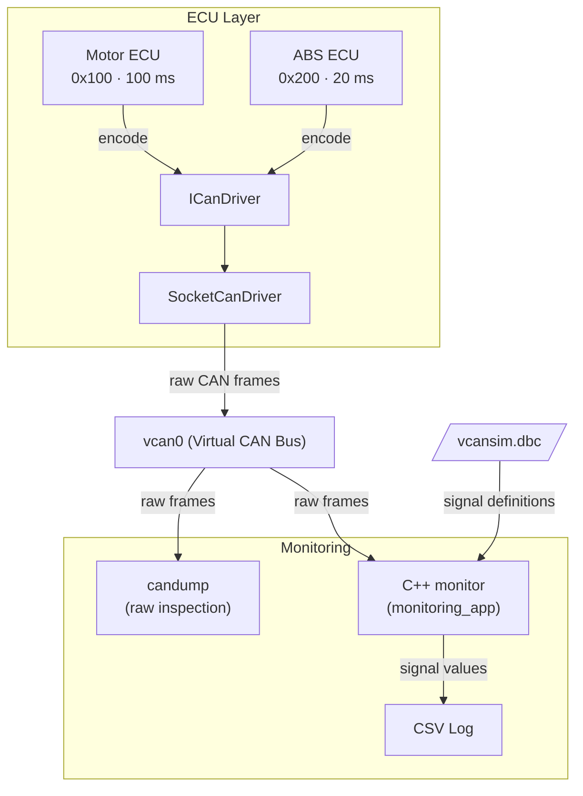

# VcanSim

> Virtual CAN Network Simulator for Embedded Linux


VcanSim simulates a multi-ECU CAN network entirely in software, no hardware required.
Built on Linux SocketCAN (`vcan`), it runs the real kernel CAN stack without any physical CAN interface.

## Overview

VcanSim consists of two simulated ECU nodes that produce realistic CAN traffic over a virtual bus,
and a C++ monitor that decodes and logs signals using the DBC-generated C helpers.

ECU logic is decoupled from the platform-specific CAN driver via an `ICanDriver` interface,
improving portability and testability.

At runtime, the Motor and ABS ECUs are launched by separate runner executables, so they operate as independent processes.

## Features

- Two C++ ECU simulators producing realistic CAN traffic over a virtual bus
- DBC-based signal definition (compatible with CANalyzer and cantools) and manual encoding in C++
- Live signal monitoring and CSV logging via the native C++ `monitoring_app` (DBC-generated C helpers)
- Optional raw frame inspection using `candump`
- GoogleTest unit tests and Python integration tests
## Architecture



**ECU (Electronic Control Unit):** a simulated vehicle node that sends cyclic CAN messages. VcanSim includes a Motor ECU (RPM, temperature) and an ABS ECU (wheel speeds). Each runs as an independent Linux process.

**ICanDriver:** a C++ abstract interface that decouples ECU logic from any specific CAN driver. ECUs call `send()` and `receive()` without knowing the underlying implementation.

**SocketCanDriver:** the concrete implementation of `ICanDriver` for Linux. It uses the POSIX socket API to write raw CAN frames to the kernel.

**vcan0:** a virtual CAN bus provided by the Linux kernel SocketCAN module. It behaves identically to a physical CAN bus but requires no hardware.

**candump:** a standard Linux tool from `can-utils` that reads raw CAN frames directly from the bus.

**cantools:** a Python library that parses DBC files and decodes raw CAN frame bytes into readable signal values such as RPM or temperature.

**DBC file:** an industry-standard file format that defines CAN message IDs, signal names, scaling, offset, and units. Used by tools like CANalyzer and cantools.

**CSV Logs:** the output of the monitor script, one file per message type, with one row per decoded frame.

## Getting Started

### Requirements

- Linux with GCC and CMake
- `libgtest-dev`
- Python 3
### Install Dependencies

**System packages:**
```bash
sudo apt install -y cmake g++ libgtest-dev python3-venv
```

**Python dependencies:**
Create a venv and install packages from `requirements.txt`:
```bash
python3 -m venv venv
./venv/bin/pip install -r requirements.txt
```

This installs:
- `cantools` — DBC parsing and frame decoding
- `pytest` — test runner
- `python-can` — CAN utilities (optional for live monitoring)

### Build

```bash
mkdir build && cd build
cmake ..
cmake --build . -j2
```

This configures and builds the project.

### Run All Tests

```bash
ctest --verbose
```

See [Testing](docs/testing.md) for detailed test documentation and individual execution.

### Run Live Simulation (Linux)

This runs the live runtime simulation path: create `vcan0`, start both ECU processes, run monitor, and collect outputs.

```bash
cmake --build build -j2
bash scripts/run_vcan_demo.sh
```

- `data/csv/*.csv`
- `data/monitor.log`

### Example Output

The runtime output lives in `data/`, with per-message CSV files under `data/csv/` and a log file (`monitor.log`) capturing decoded CAN frames and runtime activity.


#### `MotorStatus.csv`

| timestamp (Unix s) | frame_id | RPM | Temperature |
| --- | --- | --- | --- |
| 1778796278.237407 | 0x100 | 2500.0 | 88 |
| 1778796278.537598 | 0x100 | 2000.0 | 70 |

Note: Monitor timestamps are stored as Unix seconds. Consumers should convert them to human-readable format.

#### `ABSStatus.csv`

| timestamp (Unix s) | frame_id | Wheel_FL | Wheel_FR | Wheel_RL | Wheel_RR |
| --- | --- | --- | --- | --- | --- |
| 1778796278.242311 | 0x200 | 60.0 | 60.5 | 59.5 | 59.800000000000004 |
| 1778796278.643438 | 0x200 | 40.0 | 40.1 | 39.900000000000006 | 39.800000000000004 |

#### `monitor.log`

```text
monitoring vcan0 using DBC: dbc/vcansim.dbc
writing CSVs to: data/csv/
1778796278.237407 id=0x100 dlc=3 msg=MotorStatus signals={'RPM': 2500.0, 'Temperature': 88}
1778796278.242311 id=0x200 dlc=8 msg=ABSStatus signals={'Wheel_FL': 60.0, 'Wheel_FR': 60.5, 'Wheel_RL': 59.5, 'Wheel_RR': 59.800000000000004}
```
## References

- [cantools](https://github.com/cantools/cantools) : DBC parsing and C code generation
- [python-can](https://python-can.readthedocs.io) : CAN interface library
- [SocketCAN](https://docs.kernel.org/networking/can.html) : Linux kernel CAN subsystem
- [GoogleTest](https://github.com/google/googletest) : C++ test framework

## License

MIT