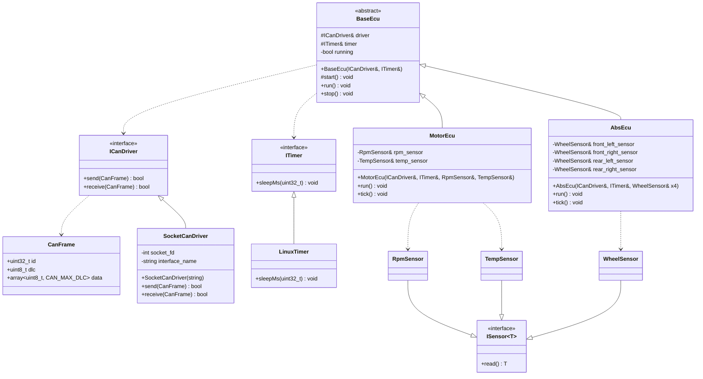

# Architecture

This document describes the architectural layers, class design, key design decisions, and technical rationale behind VcanSim.

## Layers

VcanSim is structured in four layers. Each layer has a single responsibility and a clearly defined boundary.

| Layer | Path | Language | Responsibility |
|---|---|---|---|
| ECU Layer | `src/ecu/` | C++ | ECU behavior and frame emission logic |
| Driver Layer | `src/platform/linux/socketcan/`, `src/platform/linux/`, `src/platform/linux/runner/` | C++ | Linux SocketCAN driver, Linux timer, and runner entry points |
| Common Layer | `src/common/` | C++ | Platform-independent types, interfaces, signal encoding, and abstract ECU base class |
| Monitoring | `tools/` | Python | Live DBC decoding and CSV logging (`can_monitor.py`) |

Simulation data sources used by the runners are provided in `src/sim/` (`SimRpmSensor`, `SimTempSensor`, `SimWheelSensor`).

The class diagram below describes the ECU responsibilities and dependencies. In the runnable system, the Motor and ABS ECUs are started by separate runner executables, so they execute as independent processes.

## Class Diagram



## Signal Encoding

Signal encoding is handled by the `SignalEncoder` namespace in `src/common/signal_encoder.h`.
It provides primitive byte-level operations only: `encodeUint16LE`, `encodeUint8`, `decodeUint16LE`, `decodeUint8`.
Each ECU class applies its own scaling and offset before calling these primitives.
All functions return `bool` and perform bounds checking internally.

Both `MotorEcu` and `AbsEcu` depend on `SignalEncoder` for frame payload construction.

## ICanDriver Interface

The core design decision in VcanSim is the `ICanDriver` interface.
It decouples ECU logic from any specific CAN driver implementation.

```cpp
// src/common/ican_driver.h
class ICanDriver {
public:
    virtual ~ICanDriver() = default;
    virtual bool send(const CanFrame& frame) = 0;
    virtual bool receive(CanFrame& frame) = 0;
};
```

ECUs are constructed via `BaseEcu` with a driver and timer reference. No dependency on SocketCAN or any OS-specific code directly.
`BaseEcu` does not own the driver or timer. The caller is responsible for ensuring both outlive the ECU.

```cpp
// base_ecu.cpp
BaseEcu::BaseEcu(ICanDriver& driver, ITimer& timer)
    : driver_(driver), timer_(timer) {}

// motor_ecu.cpp: knows nothing about Linux or SocketCAN
MotorEcu::MotorEcu(ICanDriver& driver, ITimer& timer)
    : BaseEcu(driver, timer) {}
```

Usage:

```cpp
LinuxTimer      timer;
SocketCanDriver driver("vcan0");  // both must outlive motor
MotorEcu        motor(driver, timer);
motor.run();
```

In the deployed runtime, this construction happens inside a dedicated ECU runner entry point, one per ECU process.

## ISensor Interface

`ISensor<T>` is a template interface that decouples ECU logic from sensor implementations.
Each ECU injects the sensors it depends on via constructor parameters.

```cpp
// src/common/isensor.h
template <typename T>
class ISensor {
public:
    virtual ~ISensor() = default;
    virtual T read() noexcept = 0;
};

// Type aliases for concreteness
using RpmSensor    = ISensor<uint16_t>;  // RPM values
using TempSensor   = ISensor<int16_t>;   // Temperature in °C
using WheelSensor  = ISensor<uint16_t>;  // Wheel speed in deci-km/h
```

**MotorEcu** injects RPM and temperature sensors:
```cpp
MotorEcu::MotorEcu(ICanDriver& driver, ITimer& timer, 
                   RpmSensor& rpm, TempSensor& temp)
    : BaseEcu(driver, timer), rpm_sensor_(rpm), temp_sensor_(temp) {}
```

**AbsEcu** injects four wheel speed sensors:
```cpp
AbsEcu::AbsEcu(ICanDriver& driver, ITimer& timer,
               WheelSensor& fl, WheelSensor& fr, 
               WheelSensor& rl, WheelSensor& rr)
    : BaseEcu(driver, timer), front_left_(fl), front_right_(fr), 
                               rear_left_(rl), rear_right_(rr) {}
```

For simulation-oriented builds, `src/sim/` provides header-only implementations (`SimRpmSensor`, `SimTempSensor`, `SimWheelSensor`) 

## Build System

CMake is used with distinct targets per layer:

| Target | Type | Links Against |
|---|---|---|
| `can_common` | Static library | |
| `can_ecu` | Static library | `can_common` |
| `can_platform` | Static library | `can_common` |
| `motor_ecu` | Executable | `can_ecu`, `can_platform` |
| `abs_ecu` | Executable | `can_ecu`, `can_platform` |
| `unit_tests` | Executable | `can_common`, `can_ecu`, GoogleTest |
| `integration_tests` | Executable | `can_common`, `can_ecu`, GoogleTest |
| `frame_dump` | Executable | `can_common`, `can_ecu` |

**`motor_ecu`** and **`abs_ecu`** are the ECU runner executables placed under `src/platform/linux/`. Each instantiates its ECU class with a `SocketCanDriver` and `LinuxTimer`, then calls `run()`.

**`unit_tests`** validates signal encoding and ECU unit behavior with mocks.

**`integration_tests`** validates ECU component integration (multi-tick, run-loop, timer) without SocketCAN.

**`python_integration`** is a unified target that builds `frame_dump` and runs pytest against `tests/integration/test_frames.py`.

For live runtime orchestration, `scripts/run_vcan_demo.sh` launches the Linux `vcan0` simulation flow and collects monitor artifacts.

For detailed validation and CI behavior, see [Testing](testing.md).

## Key Design Decisions

| Decision | Rationale |
|---|---|
| C++ for ECUs and drivers | Primary language in German embedded market |
| Python for monitor and tests | Established role: tooling and test automation, not production code |
| Manual signal encoding in C++ | Demonstrates bit-level understanding of CAN frames |
| `cantools` for Python decoding | Industry-standard tool used in real automotive projects |
| `ICanDriver` interface | Decouples ECU logic from driver, clean and testable design |
| `ITimer` interface | Decouples ECU loop timing from OS-specific sleep |
| `ISensor<T>` template interface | Decouples ECU logic from sensor implementations. Each ECU injects the specific sensors it needs. Enables simulation (header-only `Sim*Sensor` classes) and future hardware integration. |
| `BaseEcu` abstract class | Shared lifecycle, driver and timer reference, avoids duplication across ECUs |
| `bool` return for driver and encoder | Minimal error propagation. Error details intentionally not propagated. A typed status enum is a possible future extension. |
| Single-threaded ECU design | Each ECU runs a blocking loop controlled by `run()` and `stop()`. No internal threading. Each ECU is launched as an independent process. |
| No dynamic memory for frame data | Fixed-size frame payload: `std::array` on stack, no heap allocation |
| `vcan` over simulation framework | Real Linux kernel CAN stack, not a mock |