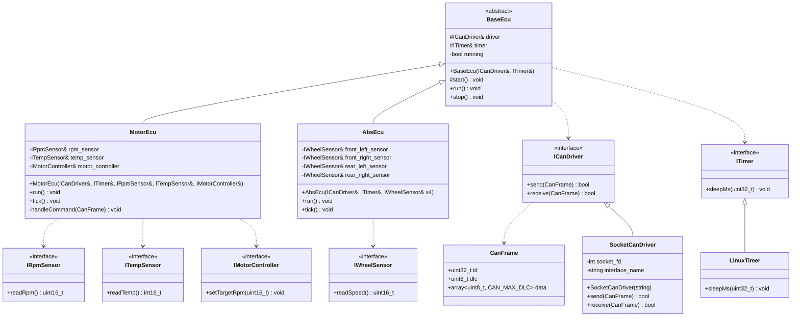
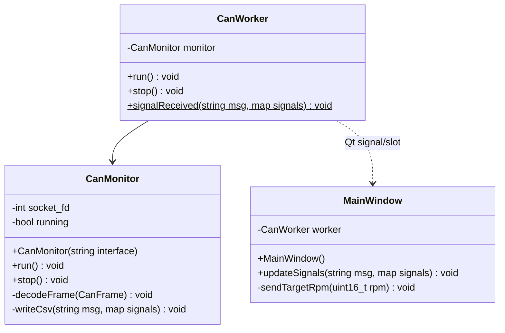

# Architecture

This document describes the architectural layers, class design, key design decisions, and technical rationale behind VcanSim.

## Layers

VcanSim is structured in five layers. Each layer has a single responsibility and a clearly defined boundary.

| Layer | Path | Language | Responsibility |
|---|---|---|---|
| ECU Layer | `src/ecu/` | C++ | ECU behavior, frame emission, and command reception logic |
| Driver Layer | `src/platform/linux/socketcan/`, `src/platform/linux/` | C++ | Linux SocketCAN driver, Linux timer |
| Common Layer | `src/common/` | C++ | Platform-independent types, interfaces, and abstract ECU base class |
| DBC Layer | `src/dbc/` | C (generated) | DBC-generated signal pack/unpack/encode/decode functions, shared by ECUs and monitor |
| Monitoring | `tools/monitor/` | C++ | Live CAN frame decoding and CSV logging using DBC-generated code |
| GUI | `tools/ui/` | C++ / Qt Widgets | Live signal display and target RPM command input |

Simulation data sources used by the runners are provided in `src/platform/linux/` (`SimWheelSensor`, `SimEngine`).

The class diagram below describes the ECU responsibilities and dependencies. In the runnable system, the Motor and ABS ECUs are started by separate runner executables, so they execute as independent processes.

## Class Diagram

### ECU Layer



### Monitoring and GUI Layer

> ECU processes communicate with the monitoring layer exclusively through
> the `vcan0` virtual CAN bus.



## Signal Encoding

Signal encoding and decoding use DBC-generated code produced at build time by `cantools generate_c_source`. Both ECUs and the monitor link against the same `can_dbc` static library, ensuring the DBC file is the single source of truth for all signal definitions. See [Signal Encoding](signal-encoding.md) for full details.

## ICanDriver Interface

The core design decision in VcanSim is the `ICanDriver` interface.
It decouples ECU logic from any specific CAN driver implementation.

```cpp
// src/common/ican_driver.h
class ICanDriver {
public:
    virtual ~ICanDriver() = default;
    virtual bool send(const CanFrame& frame) = 0;
    virtual bool receive(CanFrame& frame) = 0;
};
```

ECUs are constructed via `BaseEcu` with a driver and timer reference. No dependency on SocketCAN or any OS-specific code directly.
`BaseEcu` does not own the driver or timer. The caller is responsible for ensuring both outlive the ECU.

```cpp
// base_ecu.cpp
BaseEcu::BaseEcu(ICanDriver& driver, ITimer& timer)
    : driver_(driver), timer_(timer) {}

// motor_ecu.cpp: knows nothing about Linux or SocketCAN
MotorEcu::MotorEcu(ICanDriver& driver, ITimer& timer)
    : BaseEcu(driver, timer) {}
```

Usage:

```cpp
LinuxTimer      timer;
SocketCanDriver driver("vcan0");  // both must outlive motor
SimEngine       engine; 
MotorEcu        motor(driver, timer, engine, engine, engine);
motor.run();
```

In the deployed runtime, this construction happens inside a dedicated ECU runner entry point, one per ECU process.

## Sensor Interfaces

Named sensor interfaces decouple ECU logic from sensor implementations.
Each ECU injects the specific interfaces it needs via constructor parameters.
Separate named interfaces (rather than a generic `ISensor<T>` template) are used
to allow one class to implement multiple sensor types without method name conflicts.

```cpp
// src/common/isensors.h
class IRpmSensor {
public:
    virtual ~IRpmSensor() = default;
    virtual uint16_t readRpm() noexcept = 0;
};

class ITempSensor {
public:
    virtual ~ITempSensor() = default;
    virtual int16_t readTemp() noexcept = 0;
};

class IWheelSensor {
public:
    virtual ~IWheelSensor() = default;
    virtual uint16_t readSpeed() noexcept = 0;
};
```

**MotorEcu** injects RPM, temperature, and motor controller:
```cpp
MotorEcu::MotorEcu(ICanDriver& driver, ITimer& timer,
                   IRpmSensor& rpm, ITempSensor& temp,
                   IMotorController& controller)
    : BaseEcu(driver, timer), rpm_sensor_(rpm),
      temp_sensor_(temp), motor_controller_(controller) {}
```

**AbsEcu** injects four wheel speed sensors:
```cpp
AbsEcu::AbsEcu(ICanDriver& driver, ITimer& timer,
               IWheelSensor& fl, IWheelSensor& fr,
               IWheelSensor& rl, IWheelSensor& rr)
    : BaseEcu(driver, timer), front_left_(fl), front_right_(fr),
                               rear_left_(rl),  rear_right_(rr) {}
```

Concrete implementations are provided by the runner at construction time:
- `SimEngine` (in `src/platform/linux/sim/`) implements all three motor interfaces and is passed as three separate references to `MotorEcu`. 
- `SimWheelSensor` implements `IWheelSensor` and is instantiated once per wheel in the ABS runner.

## IMotorController Interface

`IMotorController` decouples the Motor ECU from any specific actuator implementation.
`MotorEcu` calls `setTargetRpm()` when a `MotorControl` CAN frame is received, without knowing whether the target is applied to a simulated engine or a real actuator.

```cpp
// src/common/imotor_controller.h
class IMotorController {
public:
    virtual ~IMotorController() = default;
    virtual void setTargetRpm(uint16_t rpm) noexcept = 0;
};
```


Concrete implementations are provided by the runner at construction time. See `src/platform/linux/sim/` for simulation builds and `apps/*_ecu/` for wiring details.

In the runner, `SimEngine` implements `RpmSensor`, `TempSensor`, and `IMotorController` and is passed as all three to `MotorEcu`.

## Build System

CMake is used with distinct targets per layer:

| Target | Type | Links Against |
|---|---|---|
| `can_dbc` | Static library | — |
| `can_common` | Static library | — |
| `can_ecu` | Static library | `can_common`, `can_dbc` |
| `can_platform` | Static library | `can_common` |
| `motor_ecu` | Executable | `can_ecu`, `can_platform` |
| `abs_ecu` | Executable | `can_ecu`, `can_platform` |
| `can_monitor` | Executable | `can_common`, `can_dbc`, `can_platform` |
| `vcan_ui` | Executable | `can_common`, `can_dbc`, Qt Widgets |
| `unit_tests` | Executable | `can_common`, `can_ecu`, `can_dbc`, GoogleTest |
| `integration_tests` | Executable | `can_common`, `can_ecu`, `can_dbc`, GoogleTest |
| `frame_dump` | Executable | `can_common`, `can_ecu` |

`can_dbc` is produced from `src/dbc/vcansim.c`, which is generated at configure time by a CMake custom command invoking `cantools generate_c_source`. The generated files are not tracked in version control.

**`motor_ecu`** and **`abs_ecu`** are the ECU runner executables built from `apps/*_ecu/` and linked against `can_ecu` and `can_platform`. Each instantiates its ECU class with a `SocketCanDriver` and `LinuxTimer`, then calls `run()`.

**`unit_tests`** validates signal encoding and ECU unit behavior with mocks.

**`integration_tests`** validates ECU component integration (multi-tick, run-loop, timer) without SocketCAN.

**`python_integration`** is a unified target that builds `frame_dump` and runs pytest against `tests/integration/test_frames.py`.

For live runtime orchestration, `scripts/run_vcan_demo.sh` launches the Linux `vcan0` simulation flow and collects monitor artifacts.

For detailed validation and CI behavior, see [Testing](testing.md).

## Key Design Decisions

| Decision | Rationale |
|---|---|
| Python for test automation | pytest validates the DBC file and codegen pipeline as a regression check; core signal correctness is covered by C++ unit and integration tests |
| `can_dbc` shared static library | Generated code compiled once, linked by ECUs, monitor, and GUI |
| Dedicated CAN receive thread in GUI (`CanWorker`) | Keeps the UI thread responsive; `CanWorker` emits Qt signals to `MainWindow` via queued connection, avoiding any direct cross-thread UI access |
| `ICanDriver` interface | Decouples ECU logic from driver, clean and testable design |
| `ITimer` interface | Decouples ECU loop timing from OS-specific sleep |
|`IMotorController` and named sensors interfaces | Decouples the ECU from the actuator implementation (introduced for testability) |
| `BaseEcu` abstract class | Shared lifecycle, driver and timer reference, avoids duplication across ECUs |
| `bool` return for driver | Minimal error propagation. Error details intentionally not propagated. A typed status enum is a possible future extension. |
| Single-threaded ECU design | Each ECU runs a blocking loop controlled by `run()` and `stop()`. No internal threading. Each ECU is launched as an independent process. |
| No dynamic memory for frame data | Fixed-size frame payload: `std::array` on stack, no heap allocation |
| `vcan` over simulation framework | Real Linux kernel CAN stack, not a mock |