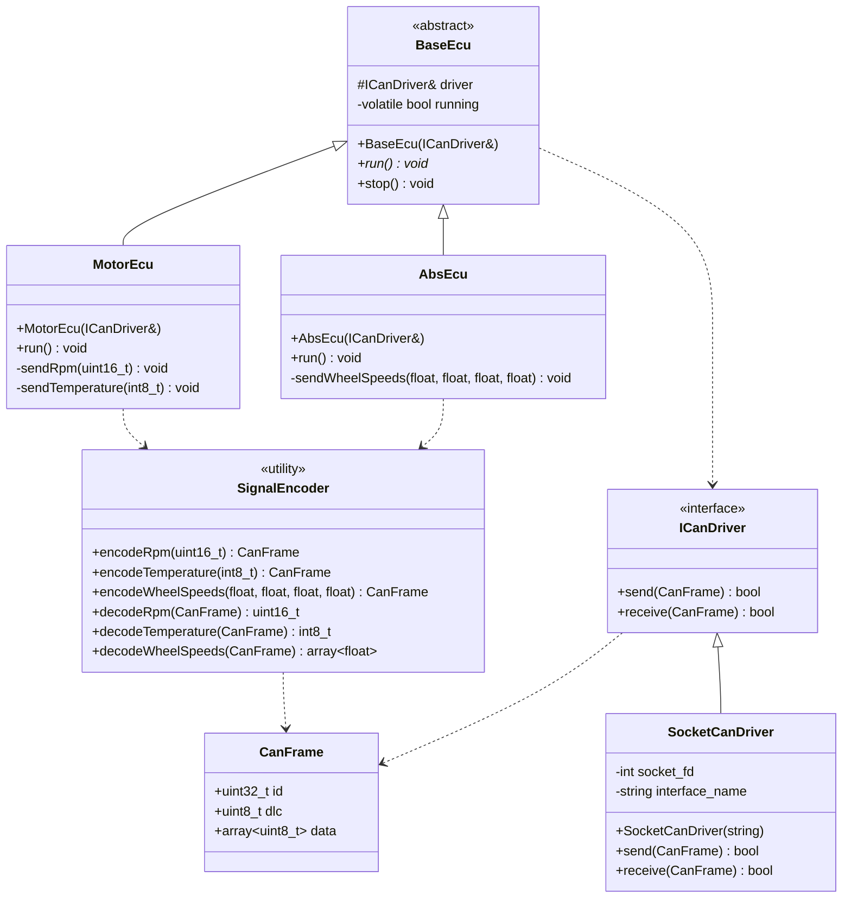

# Architecture

This document describes the architectural layers, class design, key design decisions, and technical rationale behind VcanSim.

## Layers

VcanSim is structured in four layers. Each layer has a single responsibility and a clearly defined boundary.

| Layer | Path | Language | Responsibility |
|---|---|---|---|
| ECU Layer | `src/ecu/` | C++ | What each ECU sends and when |
| Driver Layer | `src/platform/` | C++ | Hardware-specific CAN driver implementation |
| Common Layer | `src/common/` | C++ | Platform-independent types, interface, signal encoding, and abstract ECU base class |
| Monitoring | `src/monitor/` | Python | DBC decoding, CSV logging, integration tests |

## Class Diagram



## ICanDriver Interface

The core design decision in VcanSim is the `ICanDriver` interface.
It decouples ECU logic from any specific CAN driver implementation.

```cpp
// src/common/ican_driver.h
class ICanDriver {
public:
    virtual ~ICanDriver() = default;
    virtual bool send(const CanFrame& frame) = 0;
    virtual bool receive(CanFrame& frame) = 0;
};
```

ECUs are constructed via `BaseEcu` with a driver reference and have no dependency on SocketCAN directly:

```cpp
// base_ecu.cpp
BaseEcu::BaseEcu(ICanDriver& driver) : driver_(driver), running_(false) {}

// motor_ecu.cpp: knows nothing about Linux or SocketCAN
MotorEcu::MotorEcu(ICanDriver& driver) : BaseEcu(driver) {}
```

Usage:

```cpp
SocketCanDriver driver("vcan0");
MotorEcu motor(driver);
motor.run();
```

## Build System

CMake is used with distinct targets per layer:

| Target | Type | Links Against |
|---|---|---|
| `can_common` | Static library | |
| `can_platform` | Static library | `can_common` |
| `motor_ecu` | Executable | `can_platform` |
| `abs_ecu` | Executable | `can_platform` |
| `unit_tests` | Executable | `can_common`, GoogleTest |

`unit_tests` links only against `can_common`, not `can_platform`.
This ensures signal encoding logic is testable without any SocketCAN dependency.

## Key Design Decisions

| Decision | Rationale |
|---|---|
| C++ for ECUs and drivers | Primary language in German embedded market |
| Python for monitor and tests | Established role: tooling and test automation, not production code |
| Manual signal encoding in C++ | Demonstrates bit-level understanding of CAN frames |
| `cantools` for Python decoding | Industry-standard tool used in real automotive projects |
| `ICanDriver` interface | Decouples ECU logic from driver, clean and testable design |
| `BaseEcu` abstract class | Shared lifecycle and driver reference, avoids duplication across ECUs |
| No dynamic memory for frame data | Closer to resource-constrained embedded targets |
| `vcan` over simulation framework | Real Linux kernel CAN stack, not a mock |